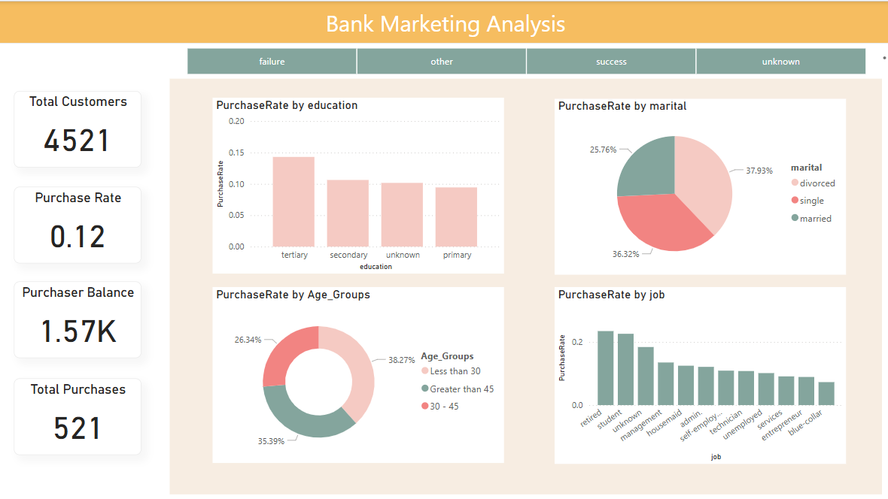
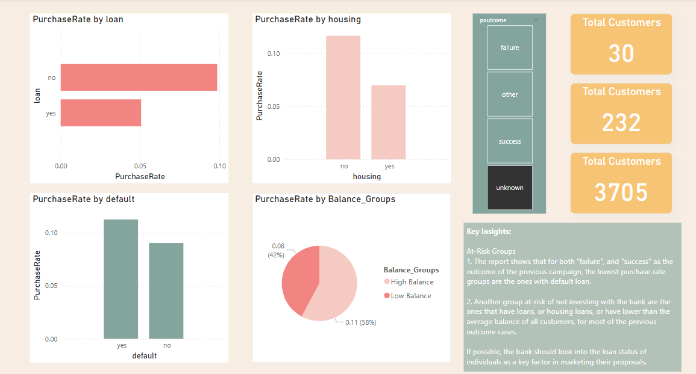
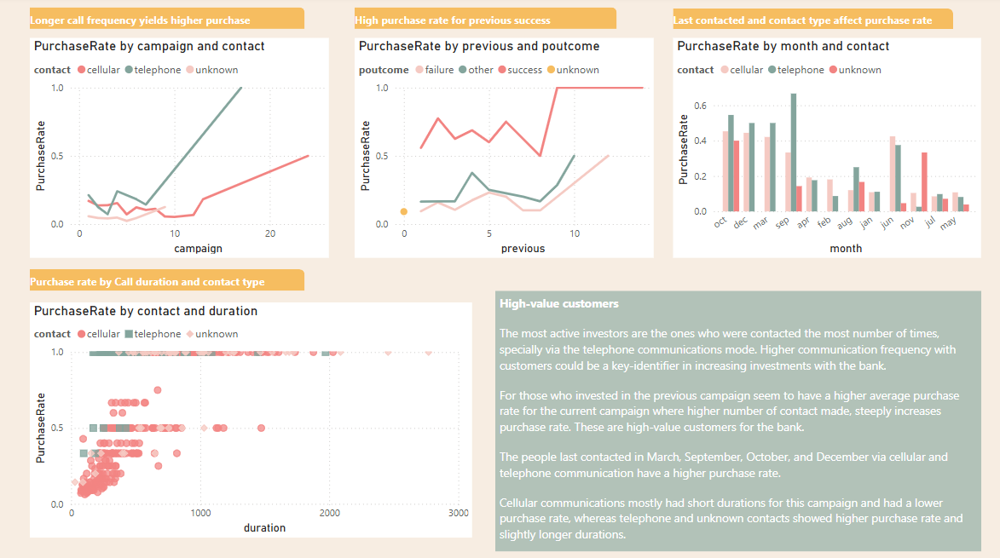

# 📊 Data Visualization – Group CA

## 📁 Project Overview

This project explores the **Bank Marketing Dataset** from the [UCI Machine Learning Repository](https://archive.ics.uci.edu/dataset/222/bank+marketing), which captures the results of phone campaigns conducted by a Portuguese banking institution. The primary objective is to determine the **likelihood of customers subscribing to a term deposit**, using various demographic, financial, and campaign-related features.

We utilized **Power BI**, **Tableau**, and **Excel** to analyze the data from different perspectives and visualize key insights that can help banks optimize marketing strategies and customer targeting.

---

## 🧠 Problem Statement

To predict and analyze **whether a customer will subscribe to a term deposit**, using:

- **Demographic Characteristics** (e.g., age, job, education)
- **Financial Status** (e.g., housing loans, personal loans, balance)
- **Campaign History** (e.g., number of contacts, outcomes, call durations)

The aim is to:
- Understand key drivers that influence customer decisions
- Identify high-value customer segments
- Optimize marketing campaign effectiveness

---

## 📂 Dataset Summary

**Source:** [UCI Bank Marketing Dataset](https://archive.ics.uci.edu/dataset/222/bank+marketing)  
**Type:** Multivariate, classification  
**Preprocessing:** Missing values checked and cleaned using Python (Pandas)

**Main Features:**
- `age`, `job`, `marital`, `education`, `default`, `housing`, `loan`
- `balance`, `contact`, `month`, `duration`, `campaign`, `pdays`, `previous`, `poutcome`, `y` (target variable)

---

## 🧮 Technologies Used

| Tool      | Contributor     | Purpose                   |
|-----------|-----------------|---------------------------|
| Excel     | Sai Nikhil      | Data summary and exploration |
| Power BI  | Himansh Arora   | Interactive dashboard creation |
| Tableau   | Shruthi         | Visual analytics and storyboards |

---

## 📊 Power BI Dashboard

The Power BI dashboard focuses on the three main dimensions: **Demographic**, **Financial**, and **Campaign** characteristics. Key metrics and visuals were created to explore customer trends, campaign success rates, and influential variables.

### 🔹 Demographic Analysis

---

### 🔹 Financial Profile & Behavior

---

### 🔹 Campaign Performance Insights

---

## 🔍 Key Insights

- **Age and job type** have a significant impact on deposit subscription rates.
- Customers with **no personal loans** and **higher balances** show greater interest in term deposits.
- **Call duration** and **contact timing (month)** strongly correlate with campaign success.
- Repeated contacts do not always increase success rate — targeting strategy matters.

---

## ✅ Conclusion

This project offers a comprehensive view of how customer demographics, financial history, and past interactions influence the outcome of marketing campaigns. These insights can help the bank:

- Improve **targeting** for future campaigns
- Tailor **messaging and timing**
- Focus on **high-yield customer segments**

---

## 📌 How to Use

1. Clone or download this repository.
2. Open the Power BI report to interact with visuals.
3. Refer to the images in this README for a preview.
4. Source data is available [here](https://archive.ics.uci.edu/dataset/222/bank+marketing).
